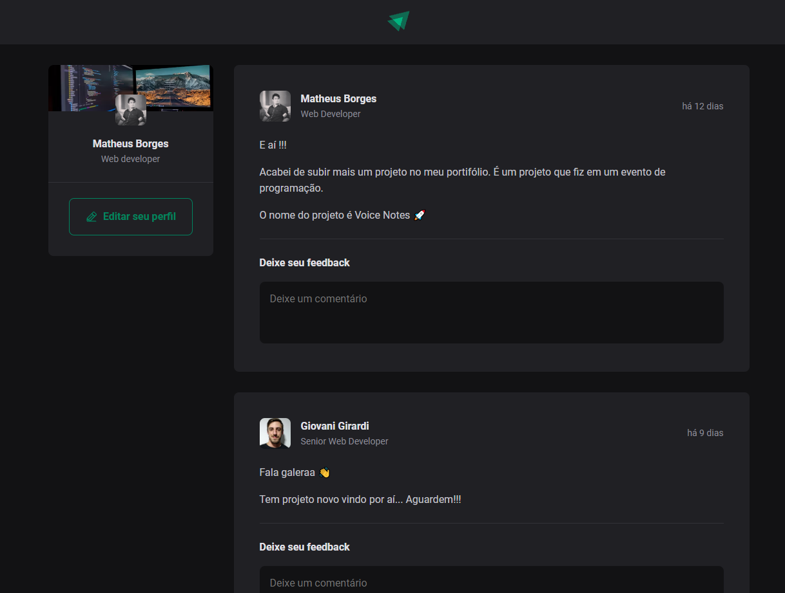
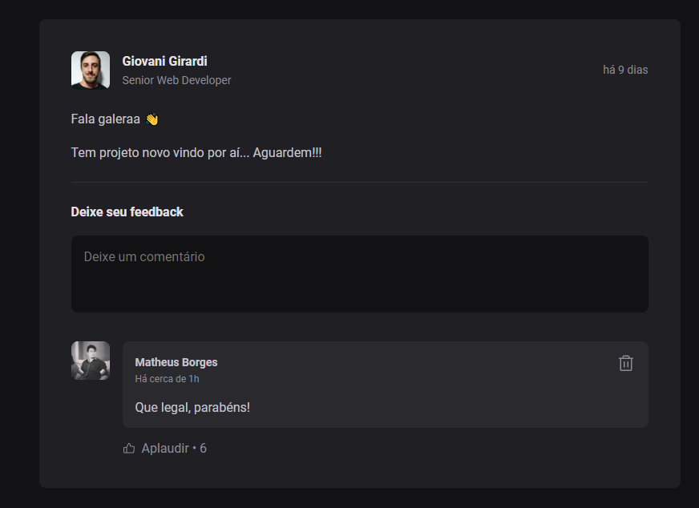

# Ignite Feed

## Like, comment and post

> The project aimed to improve knowledge about componentization, states, principle of immutability, properties and hooks, using React+Vite and TypeScript to build it.

🔗 [Click here to access](https://matheusborgesdev.github.io/ignite-feed/)

## 💻 Technologies

- React+Vite
- TypeScript

## 📧 Contact

matheusb.dev@gmail.com
